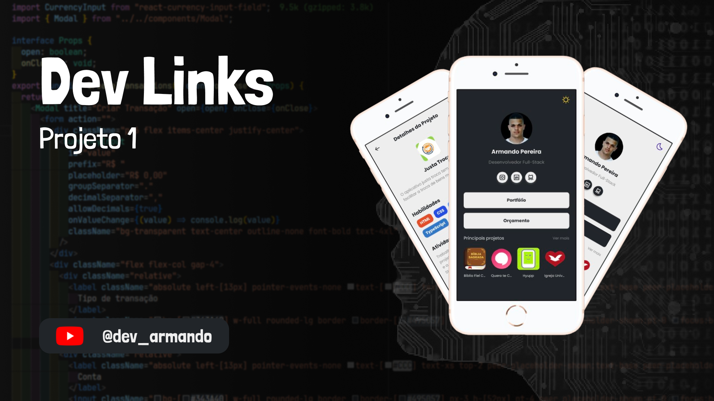

  

## 🚀 Tecnologias

Esse projeto foi desenvolvido com as seguintes tecnologias:

- React
- TypeScript
- TailwindCss

## 💻 Projeto

Nesse projeto você vai desenvolver um portal de links para testar os seus conhecimentos técnicos.

## 📝 Licença

Esse projeto está sob a licença MIT.
